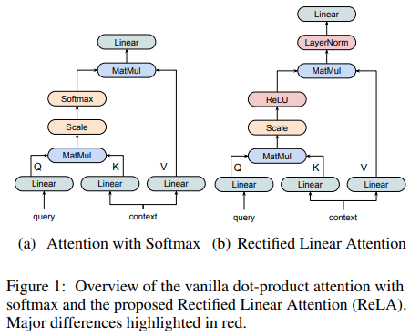

</img>

## ReLA (Rectified Linear Attention) Transformer

Implementation of a Transformer using <a href="https://arxiv.org/abs/2104.07012
">ReLA</a> (Rectified Linear Attention). It will also contain an attempt to combine the feedforward into the ReLA layer as memory key / values, as proposed in <a href="https://arxiv.org/abs/1907.01470">All Attention</a>, suggestion made by <a href="https://github.com/cfoster0">Charles Foster</a>.

## Install

```bash
$ pip install rela-transformer
```

## Usage

```python
import torch
from rela_transformer import ReLATransformer

model = ReLATransformer(
    num_tokens = 20000,
    dim = 512,
    depth = 8,
    max_seq_len = 1024,
    dim_head = 64,
    heads = 8
)

x = torch.randint(0, 20000, (1, 1024))
mask = torch.ones(1, 1024).bool()

logits = model(x, mask = mask) # (1, 1024, 20000)
```

## Enwik8

```bash
$ python train.py
```

## Citations

```bibtex
@misc{zhang2021sparse,
    title   = {Sparse Attention with Linear Units},
    author  = {Biao Zhang and Ivan Titov and Rico Sennrich},
    year    = {2021},
    eprint  = {2104.07012},
    archivePrefix = {arXiv},
    primaryClass = {cs.CL}
}
```
